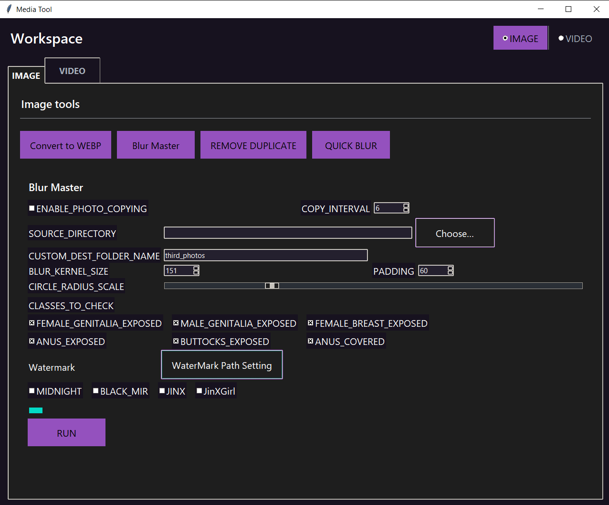

# media-tool

Tkinter UI with IMAGE/VIDEO tabs plus reusable image/video pipelines.



## Quick start
```bash
python -m venv .venv
# Windows:
.\.venv\Scripts\activate
# macOS/Linux:
# source .venv/bin/activate
pip install -e .
python -m mediatool
```


# Media Tool

A cross-platform desktop toolkit (Tkinter) for quick image & video workflows:

- **Image**
  - Convert PNG/JPG → **WEBP** (in-place or to output dir)
  - **Blur Master** (NudeNet-based detector + circular blur + optional watermarking & resize/quality)
  - **Duplicate Remover** (copy all unique images into `ALL_MERGED`, drop dupes by perceptual hash)
  - **Quick Blur** (Gaussian blur for a chosen folder or selected files)
- **Video**
  - **Transcode to H.264** (via FFmpeg)
  - **Extract Frames** (uniform FPS to an output folder)

> Built on Python + Tkinter, runs on Windows & Linux. Packaged with PyInstaller via GitHub Actions.

---

## ✨ Screenshots
_coming soon_

---

## 🧰 Requirements

- **Python** 3.10–3.13
- **FFmpeg** available on `PATH`
  - Windows: `choco install ffmpeg` or `winget install Gyan.FFmpeg`
  - Linux: `sudo apt-get install ffmpeg`
- **Linux only:** Tk bindings `python3-tk`  
  `sudo apt-get install python3-tk`

### Optional (for Blur Master)
Blur Master uses [NudeNet] detection. If you enable that pipeline you may need:

```bash
pip install nudenet onnxruntime  # CPU
# or
pip install nudenet onnxruntime-gpu  # GPU build if available


If your environment is minimal, also ensure:

bash
Copy
Edit
pip install opencv-python numpy tqdm
🚀 Install & Run
From source (editable)
bash
Copy
Edit
# Create and activate a venv (Windows PowerShell)
python -m venv .venv
. .venv/Scripts/Activate.ps1

# or Linux/macOS
python -m venv .venv
source .venv/bin/activate

# Install
pip install -e .
python -m mediatool
The UI opens with two tabs: IMAGE and VIDEO.
Shortcuts: Ctrl+1 (Image), Ctrl+2 (Video).

🖼️ Image tools
Convert to WEBP
Picks a folder and converts png/jpg/jpeg to .webp.

Replaces originals (configurable in code) or writes to output.

Blur Master
Pipeline: detect NSFW regions → circular Gaussian blur → optional watermark → resize & quality.

You can:

Toggle photo copying (copy every Nth image to a subfolder first)

Set SOURCE_DIRECTORY, DEST name, KERNEL size, PADDING, RADIUS scale

Choose classes to detect (genitalia, breast, buttocks, anus)

Manage Watermark sets (paths for portrait/landscape PNGs)

Set MAX_WIDTH / MAX_HEIGHT / JPEG quality / Opacity

If you see an error about onnxruntime, install it (CPU or GPU build).
Example: pip install onnxruntime (or onnxruntime-gpu).

Duplicate Remover
Scans source recursively, copies images to ALL_MERGED/, removes perceptual duplicates using imagehash.

Quick Blur
Select one folder or specific files, choose radius, and run.

If output is empty, images are written to "<input>_blurred" next to the input.

🎬 Video tools
Transcode H.264
Single-file H.264 transcode via FFmpeg. Choose input and let it run.

Extract Frames
Extract still frames at a set FPS (default: 1) into an output folder.

📦 Project layout
graphql
Copy
Edit
media-tool/
├─ pyproject.toml
├─ requirements.txt
├─ README.md
├─ .gitignore
├─ .env.example                 # optional env (e.g., FFMPEG path hints)
├─ data/
│  ├─ input/
│  └─ output/
├─ models/                      # (your models, e.g., best.onnx), ignored in git
└─ src/
   └─ mediatool/
      ├─ __init__.py
      ├─ __main__.py            # `python -m mediatool` launches UI
      ├─ ui/
      │  └─ app.py              # Tkinter app
      ├─ image/
      │  ├─ ops.py
      │  └─ pipelines/
      │     ├─ convert_webp.py
      │     ├─ blur_script_interactive.py
      │     └─ dedupe.py
      └─ video/
         ├─ ops.py
         └─ pipelines/
            ├─ transcode_ffmpeg.py
            └─ extract_frames.py
⚙️ Configuration
Optional .env (see .env.example):

ini
Copy
Edit
# Example: overwrite default ffmpeg binary lookup
FFMPEG_BIN=C:\ffmpeg\bin\ffmpeg.exe
🏗️ Development
Lint & build locally
bash
Copy
Edit
pip install ruff build
ruff check .
python -m build
Run tests/smoke (import)
bash
Copy
Edit
python -c "import mediatool; print('OK')"
🛠️ One-file binaries (local)
The repo ships GitHub Actions to build these automatically, but you can build locally too.

Windows

powershell
Copy
Edit
pip install pyinstaller
pyinstaller -F -w --name MediaTool `
  --hidden-import=tkinter `
  --collect-all PIL `
  src/mediatool/__main__.py
Linux

bash
Copy
Edit
sudo apt-get install python3-tk ffmpeg
pip install pyinstaller
pyinstaller -F -w --name mediatool \
  --hidden-import=tkinter \
  --collect-all PIL \
  src/mediatool/__main__.py
Artifacts end up in dist/.

🚥 CI / Releases
CI: runs on push & PR (Windows + Ubuntu, Py 3.10–3.13).

Release: tag vX.Y.Z to build wheels/sdist and PyInstaller binaries and upload them to GitHub Releases.

❓ Troubleshooting
onnxruntime not found while running Blur Master
→ pip install onnxruntime (or onnxruntime-gpu if you have CUDA).

Linux Tk error
→ sudo apt-get install python3-tk

FFmpeg not found
→ Install FFmpeg and ensure ffmpeg is on your PATH (see Requirements).

💬 Notes
Watermark images should be transparent PNG; provide both portrait and landscape paths per set.

Duplicate detection uses perceptual hashing; not every near-duplicate is guaranteed to be caught, but it’s fast and robust for common cases.

📄 License
Choose a license for your repo (MIT/Apache-2.0/etc.) and add it to the repository.
